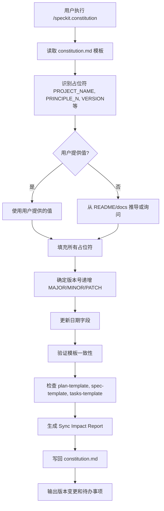
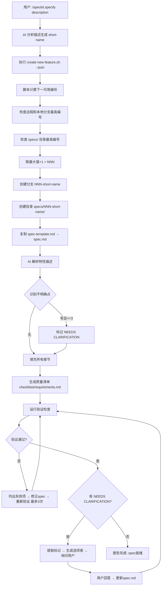
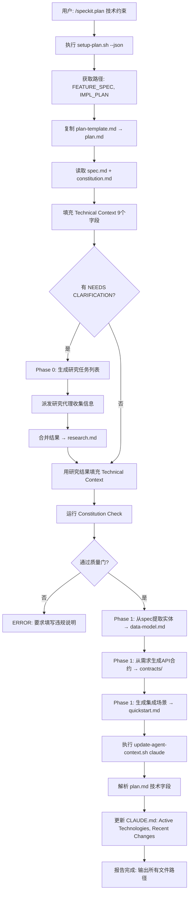
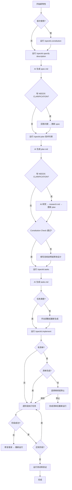

# spec-kit 框架工作流程完整解释

**版本**: 1.0.0
**创建日期**: 2026-01-19
**适用对象**: spec-kit 框架用户
**文档目的**: 理解命令执行机制、脚本协同工作方式，以及如何调整框架行为

---

## 目录

- [第一部分：概览与导航](#第一部分概览与导航)
- [第二部分：完整工作流链路详解](#第二部分完整工作流链路详解)
- [第三部分：脚本协同机制深度解析](#第三部分脚本协同机制深度解析)
- [第四部分：场景驱动调整指南](#第四部分场景驱动调整指南)
- [第五部分：快速参考和索引](#第五部分快速参考和索引)
- [附录](#附录)

---

## 第一部分：概览与导航

### 1.1 文档说明

#### 文档用途

本文档旨在帮助 spec-kit 框架的使用者：
1. **理解工作流程**：掌握从 constitution → specify → plan → tasks → implement 的完整执行链条
2. **理解脚本协同**：了解命令如何触发脚本、脚本如何处理模板、信息如何在命令间传递
3. **定位修改位置**：当需要调整框架行为时，能够快速找到应该修改的文件和代码位置

#### 目标读者

- spec-kit 框架的新手用户，希望深入理解底层机制
- 需要自定义框架行为以适配特定项目需求的开发者
- 单人开发者，使用多种技术栈，依赖 Claude 和 Git 工作流

#### 如何使用本文档

**首次阅读**：
1. 阅读第一部分（本部分）获取全局视角
2. 浏览第二部分了解每个命令的详细机制
3. 参考第五部分的快速索引表

**问题诊断**：
1. 查阅第五部分的错误信息速查表
2. 根据错误类型定位到对应章节
3. 查看具体的错误处理和解决方法

**定制调整**：
1. 根据需求类型查阅第四部分的场景指南
2. 找到需要修改的文件路径和具体位置
3. 参考第三部分理解修改的影响范围

#### 符号和约定说明

- **文件路径**: 使用反引号标记，如 `.claude/commands/speckit.specify.md`
- **命令**: 使用斜杠前缀，如 `/speckit.specify`
- **占位符**: 使用方括号，如 `[FEATURE_NAME]`
- **变量**: 使用美元符号，如 `$ARGUMENTS`
- **函数**: 使用括号，如 `get_feature_paths()`
- **行号**: 使用冒号后跟数字，如 `:23-45`表示第 23 到 45 行

---

### 1.2 框架全景图

#### spec-kit 框架的设计哲学

spec-kit 是一个**规格驱动开发（Spec-Driven Development）**框架，核心理念是：
1. **先规格，后实施**：通过结构化文档明确需求和设计，再进行编码
2. **渐进式细化**：从用户需求（spec） → 技术设计（plan） → 任务分解（tasks） → 代码实施（implement）
3. **质量内建**：通过 Constitution（项目宪法）和验证清单确保质量门
4. **AI 协同**：利用 AI（如 Claude）自动化文档生成、任务分解和代码实施

#### 核心概念

**命令（Commands）**：
- 位置：`.claude/commands/speckit.*.md`
- 作用：定义 AI 执行的工作流程步骤
- 特点：包含详细的执行逻辑、验证规则和错误处理指导

**脚本（Scripts）**：
- 位置：`.specify/scripts/bash/`
- 作用：处理文件系统操作、Git 管理、JSON 通信
- 特点：Bash 编写，严格错误处理（set -e -u -o pipefail）

**模板（Templates）**：
- 位置：`.specify/templates/`
- 作用：提供文档结构和占位符
- 特点：包含占位符（`[PLACEHOLDER]`）由 AI 或脚本填充

**占位符（Placeholders）**：
- 类型 A：方括号形式 `[FEATURE_NAME]` - AI 填充
- 类型 B：美元符号形式 `$ARGUMENTS` - 脚本替换
- 类型 C：特殊标记 `[NEEDS CLARIFICATION: ...]` - 标记待澄清内容

#### 目录结构总览

```
项目根目录/
├── .claude/                    # Claude AI 配置
│   └── commands/               # 命令定义文件
│       ├── speckit.constitution.md
│       ├── speckit.specify.md
│       ├── speckit.plan.md
│       ├── speckit.tasks.md
│       ├── speckit.implement.md
│       └── ...
├── .specify/                   # spec-kit 框架核心
│   ├── memory/                 # 项目记忆
│   │   └── constitution.md     # 项目宪法
│   ├── scripts/bash/           # Bash 脚本
│   │   ├── common.sh           # 通用函数库
│   │   ├── create-new-feature.sh
│   │   ├── setup-plan.sh
│   │   ├── check-prerequisites.sh
│   │   └── update-agent-context.sh
│   └── templates/              # 文档模板
│       ├── spec-template.md
│       ├── plan-template.md
│       ├── tasks-template.md
│       └── agent-file-template.md
├── specs/                      # 特性文档目录
│   └── 001-feature-name/       # 单个特性目录
│       ├── spec.md             # 功能规格说明
│       ├── plan.md             # 技术实施计划
│       ├── tasks.md            # 任务清单
│       ├── research.md         # 技术研究（可选）
│       ├── data-model.md       # 数据模型（可选）
│       ├── quickstart.md       # 快速入门（可选）
│       ├── contracts/          # API 合约（可选）
│       └── checklists/         # 质量清单（可选）
├── CLAUDE.md                   # Claude 代理上下文
└── 项目代码文件...
```

#### 快速导航

**按需求跳转**：
- 想了解命令执行流程 → [第二部分：完整工作流链路详解](#第二部分完整工作流链路详解)
- 想知道脚本如何协同 → [第三部分：脚本协同机制深度解析](#第三部分脚本协同机制深度解析)
- 想调整框架行为 → [第四部分：场景驱动调整指南](#第四部分场景驱动调整指南)
- 想快速查找信息 → [第五部分：快速参考和索引](#第五部分快速参考和索引)

---

### 1.3 五命令速览表

| 命令 | 功能 | 输入 | 输出 | 关键脚本 | 主要模板 | 典型用时 |
|------|------|------|------|----------|----------|----------|
| `/speckit.constitution` | 创建/更新项目开发原则 | 原则描述（可选） | `constitution.md` | 无 | `constitution.md` | 首次：10-15分钟<br>更新：5分钟 |
| `/speckit.specify` | 将自然语言转为结构化规格 | 特性描述 | `spec.md`<br>`checklists/requirements.md` | `create-new-feature.sh` | `spec-template.md` | 5-10分钟 |
| `/speckit.plan` | 生成技术实施计划 | 技术约束（可选） | `plan.md`<br>`research.md`<br>`data-model.md`<br>`contracts/`<br>`quickstart.md`<br>更新 `CLAUDE.md` | `setup-plan.sh`<br>`update-agent-context.sh` | `plan-template.md`<br>`agent-file-template.md` | 10-20分钟 |
| `/speckit.tasks` | 分解为可执行任务 | 无 | `tasks.md` | `check-prerequisites.sh` | `tasks-template.md` | 5-10分钟 |
| `/speckit.implement` | 执行代码实施 | 无 | 项目代码文件<br>更新的 `tasks.md`<br>忽略文件 | `check-prerequisites.sh` | 无 | 视项目规模<br>30分钟-数小时 |

**命令依赖链**：
```
constitution (可选) → specify (必需) → plan (必需) → tasks (必需) → implement (必需)
```

**各命令职责边界**：
- **constitution**: 定义"为什么"和"质量标准"
- **specify**: 定义"做什么"（WHAT）和"为谁做"（WHO）
- **plan**: 定义"用什么技术"（WITH WHAT）和"如何组织"（HOW TO ORGANIZE）
- **tasks**: 定义"具体步骤"（STEPS）和"执行顺序"（ORDER）
- **implement**: 执行"写代码"（CODE）和"验证"（VERIFY）

---

## 第二部分：完整工作流链路详解

本部分详细解释 spec-kit 框架的五个核心命令，每个命令包含：执行流程图、文件清单、关键机制、修改调整点和错误处理。

---

### 2.1 /speckit.constitution - 项目宪法创建

#### 命令概述

- **职责**：创建或更新项目开发原则和质量标准
- **触发时机**：项目初始化或需要调整开发标准时
- **输入**：原则描述（可选，AI 可推导）
- **输出**：`.specify/memory/constitution.md`（包含 Sync Impact Report）

#### 执行流程



#### 涉及文件清单

**命令定义**：
- `.claude/commands/speckit.constitution.md` (83 行)

**模板文件**：
- `.specify/memory/constitution.md` (99 行) - 读取和写入

**影响文件**（一致性检查）：
- `.specify/templates/plan-template.md` - Constitution Check 部分需对齐
- `.specify/templates/spec-template.md` - Success Criteria 需匹配原则
- `.specify/templates/tasks-template.md` - 任务类型需符合测试标准

#### 关键占位符

- `[PROJECT_NAME]` - 项目名称
- `[CONSTITUTION_VERSION]` - 语义化版本号（如 1.2.0）
- `[RATIFICATION_DATE]` - 首次通过日期（ISO 8601 格式）
- `[LAST_AMENDED_DATE]` - 最后修订日期
- `[PRINCIPLE_N_NAME]` - 原则名称（N 可变，支持任意数量原则）
- 原则内容区块 - 每个原则的详细描述和理由

#### 验证机制

1. **占位符完整性检查**：确保无剩余未替换的方括号占位符
2. **版本号验证**：遵循语义化版本规则（MAJOR.MINOR.PATCH）
3. **日期格式验证**：必须为 YYYY-MM-DD 格式
4. **原则可测性检查**：避免使用 "should" 等模糊词汇，使用 "MUST"
5. **模板同步验证**：检查相关模板是否需要更新

#### 修改调整点

**调整原则数量**：
- **位置**：`.specify/memory/constitution.md`
- **方法**：添加/删除 `### [PRINCIPLE_N_NAME]` 章节和对应占位符
- **影响**：AI 在命令执行时会自动适配新的原则数量

**自定义质量门**：
- **位置**：constitution.md 第 71-77 行 Quality Gates 部分
- **方法**：添加项目特定的检查点（如"代码覆盖率 >80%"）
- **影响**：plan 命令会在 Constitution Check 中引用这些门槛

**扩展同步检查**：
- **位置**：`.claude/commands/speckit.constitution.md` 第 43-48 行
- **方法**：添加新的模板文件到验证列表
- **影响**：确保新模板也遵循 constitution 原则

#### 错误处理

**场景 1：关键字段缺失**
- 错误：无法推导 RATIFICATION_DATE
- 处理：插入 `TODO(RATIFICATION_DATE): Please provide the initial adoption date`
- 报告：在 Sync Impact Report 的 "Follow-up TODOs" 中列出

**场景 2：版本递增逻辑不明**
- 错误：修改既有新增原则又有删除原则
- 处理：提示用户选择 MAJOR（删除） 或 MINOR（新增）
- 输出：说明版本选择理由

**场景 3：模板同步失败**
- 错误：plan-template.md 的 Constitution Check 部分格式不符
- 处理：在 Sync Impact Report 中标记 `⚠ pending`
- 建议：手动检查并更新模板

---

### 2.2 /speckit.specify - 功能规格说明创建

#### 命令概述

- **职责**：将自然语言特性描述转换为结构化规格说明
- **输入**：用户的特性描述（`$ARGUMENTS`）
- **输出**：
  - `specs/###-short-name/spec.md` - 主规格文档
  - `specs/###-short-name/checklists/requirements.md` - 质量验证清单
  - Git 分支：`###-short-name`（如启用 Git）

#### 执行流程



#### 脚本机制：create-new-feature.sh

**关键功能**（第 180-226 行）：
```bash
generate_branch_name() {
    # 1. 分词并转小写
    # 2. 过滤停用词（the, a, to, for...）
    # 3. 保留长度 >=3 的有意义词
    # 4. 保留大写缩写（API, UI等）
    # 5. 取前 3-4 个词，连字符连接
}
```

**编号计算**（第 129-150 行）：
- 扫描 `git branch -a` 提取所有分支的 `###-*` 编号
- 扫描 `specs/` 目录提取所有 `###-*` 目录编号
- 取两者最大值 +1

**JSON 输出示例**：
```json
{
  "BRANCH_NAME": "003-user-authentication",
  "SPEC_FILE": "/path/to/specs/003-user-authentication/spec.md",
  "FEATURE_NUM": "003"
}
```

#### 验证机制：质量清单

**清单结构**（自动生成）：
```markdown
# Specification Quality Checklist

## Content Quality
- [ ] No implementation details (languages, frameworks)
- [ ] Focused on user value and business needs
- [ ] Written for non-technical stakeholders

## Requirement Completeness
- [ ] No [NEEDS CLARIFICATION] markers remain
- [ ] Requirements are testable and unambiguous
- [ ] Success criteria are measurable and technology-agnostic
- [ ] All acceptance scenarios defined
- [ ] Edge cases identified
- [ ] Scope clearly bounded
```

**验证流程**（commands 文件 :141-192 行）：
1. 逐项检查 spec.md 内容
2. 失败项 → 自动修正（最多 3 次迭代）
3. 仍失败 → 记录到清单 notes，警告用户
4. NEEDS CLARIFICATION → 生成选项表询问用户

#### 修改调整点

**调整 A：修改规格说明结构**
- **文件**：`.specify/templates/spec-template.md`
- **方法**：添加/删除章节（如添加 "Security Requirements"）
- **同步**：更新命令文件 :103-140 行的质量清单对应项

**调整 B：自定义短名称生成**
- **文件**：`.specify/scripts/bash/create-new-feature.sh`
- **函数**：`generate_branch_name()` :180-226 行
- **可调**：停用词列表（:185）、最小词长（:198）、最大词数（:209-210）

**调整 C：修改 NEEDS CLARIFICATION 限制**
- **文件**：`.claude/commands/speckit.specify.md`
- **位置**：:85 行（当前最多 3 个）
- **影响**：:158 行的提取逻辑需同步修改

**调整 D：为不同项目类型创建专属模板**
- **方法**：
  1. 复制 `spec-template.md` → `spec-template-frontend.md`
  2. 修改章节（如将 "Key Entities" 改为 "Key Components"）
  3. 在命令文件 :100 行添加项目类型检测逻辑

#### 错误处理

| 错误场景 | 触发位置 | 错误信息 | 处理方法 |
|---------|---------|---------|---------|
| 特性描述为空 | commands :76 | `ERROR "No feature description provided"` | 提示用户提供描述 |
| 无法确定用户场景 | commands :88 | `ERROR "Cannot determine user scenarios"` | 要求更详细描述 |
| 验证失败 3 次 | commands :154 | 警告：剩余问题已记录到清单 | 用户手动修正或用 `/speckit.clarify` |
| 分支名超长 | script :256-272 | Warning: 自动截断 | 显示原始和截断后的分支名 |

---

### 2.3 /speckit.plan - 技术实施计划

#### 命令概述

- **职责**：基于规格说明生成技术设计文档
- **前提**：spec.md 已完成且通过验证
- **输入**：技术约束（可选，如 "Use Python + Flask"）
- **输出**：
  - `plan.md` - 技术实施计划
  - `research.md` - 技术研究（如有 NEEDS CLARIFICATION）
  - `data-model.md` - 数据模型
  - `contracts/` - API 合约
  - `quickstart.md` - 快速入门
  - 更新 `CLAUDE.md` - 代理上下文

#### 执行流程



#### 脚本机制：update-agent-context.sh

**数据提取**（:168-206 行）：
```bash
parse_plan_data() {
    NEW_LANG=$(extract_plan_field "Language/Version" "$plan_file")
    NEW_FRAMEWORK=$(extract_plan_field "Primary Dependencies" "$plan_file")
    NEW_DB=$(extract_plan_field "Storage" "$plan_file")
    NEW_PROJECT_TYPE=$(extract_plan_field "Project Type" "$plan_file")
}
```

**代理文件更新**（:363-502 行）：
1. 查找 `## Active Technologies` 部分
2. 添加新技术条目：`- TypeScript 5.x + Next.js (003-feature)`
3. 查找 `## Recent Changes` 部分
4. 插入新变更，保留最近 2 条旧记录
5. 更新时间戳

**支持的代理文件**（:62-77 行）：
- Claude: `CLAUDE.md`
- Gemini: `GEMINI.md`
- Copilot: `.github/agents/copilot-instructions.md`
- Cursor: `.cursor/rules/specify-rules.mdc`
- 其他 11+ 种 AI 代理

#### Constitution Check 机制

**定义**：plan-template.md :30-34 行
```markdown
## Constitution Check
*GATE: Must pass before Phase 0 research. Re-check after Phase 1 design.*
[Gates determined based on constitution file]
```

**执行**：AI 读取 constitution.md 的原则，检查 Technical Context 是否违规

**违规处理**（plan-template.md :99-104 行）：
```markdown
## Complexity Tracking
| Violation | Why Needed | Simpler Alternative Rejected Because |
|-----------|------------|-------------------------------------|
| 4th project | Current need | Why 3 projects insufficient |
```

#### 修改调整点

**调整 A：添加新技术栈字段**
- **位置 1**：plan-template.md :20-28 Technical Context 部分
- **位置 2**：update-agent-context.sh :183-206 添加字段提取
- **位置 3**：update-agent-context.sh :246-263 添加命令生成规则
- **示例**：添加 `**CI/CD**: [e.g., GitHub Actions or NEEDS CLARIFICATION]`

**调整 B**：修改项目结构选项
- **位置**：plan-template.md :59-92
- **方法**：添加 Option 4（如 Rust 项目结构）或修改现有选项
- **同步**：update-agent-context.sh :236-244 的 `get_project_structure()`

**调整 C：支持新 AI 代理**
- **位置 1**：update-agent-context.sh :62-77 添加文件路径变量
- **位置 2**：:584-642 `update_specific_agent()` 添加 case
- **位置 3**：:644-728 `update_all_existing_agents()` 添加文件检查

#### 错误处理

| 错误场景 | 错误信息 | 处理方法 |
|---------|---------|---------|
| plan.md 不存在 | 由 setup-plan.sh 报告 | 提示运行 `/speckit.specify` |
| Constitution Check 失败 | ERROR: 列出违规项 | 填写 Complexity Tracking 表或修改设计 |
| Phase 0 研究后仍有未解决项 | 未明确定义 | 重新研究或手动填写 |
| 代理上下文更新失败 | 权限/模板缺失 | 检查文件权限，确保模板存在 |

---

### 2.4 /speckit.tasks - 任务分解生成

#### 命令概述

- **职责**：将技术计划分解为可执行任务清单
- **前提**：plan.md 和 spec.md 已完成
- **输入**：无（从现有文档读取）
- **输出**：`tasks.md` - 按用户故事组织的任务列表

#### 执行流程

```mermaid
graph TD
    A[用户: /speckit.tasks] --> B[执行 check-prerequisites.sh --json]
    B --> C[验证: FEATURE_DIR, plan.md 存在]
    C --> D[返回 FEATURE_DIR + AVAILABLE_DOCS 列表]
    D --> E[加载必需: plan.md, spec.md]
    E --> F[加载可选: data-model.md, contracts/, research.md]
    F --> G[从 spec.md 提取用户故事 + 优先级 P1/P2/P3]
    G --> H[从 plan.md 提取技术栈和项目结构]
    H --> I{data-model.md 存在?}
    I -->|是| J[提取实体 → 映射到用户故事]
    I -->|否| K[跳过实体任务]
    J --> L{contracts/ 存在?}
    K --> L
    L -->|是| M[提取端点 → 映射到用户故事]
    L -->|否| N[跳过合约任务]
    M --> O[生成阶段结构]
    N --> O
    O --> P[Phase 1: Setup - 项目初始化]
    P --> Q[Phase 2: Foundational - 阻塞性基础设施]
    Q --> R[Phase 3+: 按优先级为每个用户故事生成阶段]
    R --> S[Final Phase: Polish - 优化和交叉关注点]
    S --> T[为每个任务分配格式: - [ ] TID [P?] [Story] 描述 文件路径]
    T --> U[生成依赖关系图]
    U --> V[生成并行执行示例]
    V --> W[写入 tasks.md]
    W --> X[报告: 任务总数, MVP范围, 并行机会]
```

#### 任务格式规则（强制）

**标准格式**（commands :75-104 行）：
```
- [ ] [TaskID] [P?] [Story?] Description with file path
```

**组件说明**：
1. **Checkbox**: `- [ ]` - Markdown 复选框
2. **Task ID**: T001, T002... - 按执行顺序编号
3. **[P] marker**: 可并行（不同文件、无依赖）
4. **[Story] label**: [US1], [US2]... - 用户故事映射
5. **Description**: 明确操作 + 精确文件路径

**示例对比**：
- ✅ `- [ ] T012 [P] [US1] Create User model in src/models/user.py`
- ❌ `- [ ] Create User model` （缺 ID、Story、路径）
- ❌ `T001 [US1] Create model` （缺 checkbox）

#### 阶段结构和依赖

**阶段定义**（commands :130-138 行）：
1. **Phase 1: Setup** - 项目初始化（无前置依赖）
2. **Phase 2: Foundational** - 阻塞性基础设施（依赖 Setup）
3. **Phase 3+: User Stories** - 按 P1, P2, P3... 优先级（依赖 Foundational）
4. **Final Phase: Polish** - 跨故事的优化（依赖所有故事）

**故事内依赖**（模板 :180-186 行）：
- Tests → Models → Services → Endpoints → Integration
- 每个故事应独立可测试

**并行机会**（模板 :188-195 行）：
- Setup 阶段内所有 [P] 任务
- Foundational 完成后，所有用户故事可并行
- 单个故事内：所有 models [P]、所有 tests [P]

#### 修改调整点

**调整 A：任务粒度 - 更细**
- **位置**：commands :39 行或模板 :91-96 行
- **方法**：将单个任务拆分（如 "Create User model" → "Define schema" + "Add validation" + "Add DB mapping"）
- **影响**：任务总数增加 2-3 倍，每个任务更原子化

**调整 B：任务粒度 - 更粗**
- **位置**：同上
- **方法**：合并相关任务（如 "Authentication Flow" = User model + AuthService + endpoints）
- **影响**：任务总数减少 50-70%

**调整 C：为不同项目类型定制**
- **方法**：
  1. 复制 tasks-template.md → tasks-template-frontend.md
  2. 替换 "Models" → "Components", "Services" → "Hooks"
  3. 在 commands :32 行添加项目类型检测
- **影响**：前端项目生成组件任务而非模型任务

**调整 D：自定义 MVP 范围**
- **当前**：MVP = Setup + Foundational + User Story 1 (P1)
- **修改**：在 commands :61 行添加逻辑，标记多个故事为 MVP

#### 错误处理

| 错误场景 | 错误信息 | 处理方法 |
|---------|---------|---------|
| plan.md 不存在 | ERROR: plan.md not found | 运行 `/speckit.plan` |
| spec.md 缺用户故事 | AI 判断报告 | 返回 `/speckit.specify` 补充 |
| 可选文档不存在 | 不报错 | 跳过相关任务类型 |
| 任务格式验证失败 | 报告格式错误的任务 | 修正格式 |

---

### 2.5 /speckit.implement - 实施执行

#### 命令概述

- **职责**：按 tasks.md 逐任务执行代码实施
- **前提**：tasks.md 已生成
- **输入**：无（从 tasks.md 读取）
- **输出**：
  - 项目代码文件（根据任务）
  - 更新的 `tasks.md`（标记 [X]）
  - 忽略文件（.gitignore 等）

#### 执行流程

```mermaid
graph TD
    A[用户: /speckit.implement] --> B[执行 check-prerequisites.sh --json --require-tasks]
    B --> C{FEATURE_DIR/checklists/ 存在?}
    C -->|否| D[跳过清单检查]
    C -->|是| E[扫描所有清单文件]
    E --> F[统计: Total, Completed, Incomplete]
    F --> G{所有清单完成?}
    G -->|是| H[显示 PASS 表格 → 自动继续]
    G -->|否| I[显示 FAIL 表格]
    I --> J[询问: 是否继续?]
    J --> K{用户回答}
    K -->|no/wait/stop| L[停止执行]
    K -->|yes/continue| M[继续]
    H --> M
    D --> M
    M --> N[加载: tasks.md, plan.md, 所有设计文档]
    N --> O{Git 仓库?}
    O -->|是| P[创建/验证 .gitignore]
    O -->|否| Q[跳过]
    P --> R[检测其他忽略文件需求: .dockerignore, .eslintignore]
    Q --> R
    R --> S[从 plan.md 读取技术栈 → 应用对应忽略模式]
    S --> T[解析 tasks.md: 提取阶段, 任务, 依赖, [P]标记]
    T --> U[Phase 1: Setup - 执行所有任务]
    U --> V[标记完成任务 → tasks.md: - [X]]
    V --> W{Phase成功?}
    W -->|否| X[停止, 报告错误]
    W -->|是| Y[Phase 2: Foundational]
    Y --> Z[Phase 3+: User Stories 按优先级]
    Z --> AA[Final Phase: Polish]
    AA --> AB[验证: 所有任务完成, 测试通过, 匹配规格]
    AB --> AC[报告完成状态 + 工作摘要]
```

#### 清单验证机制

**检查逻辑**（commands :17-42 行）：
```bash
for checklist in checklists/*.md; do
    total=$(grep -c '- \[ \]\|- \[X\]' "$checklist")
    completed=$(grep -c '- \[X\]' "$checklist")
    incomplete=$((total - completed))
done
```

**状态表示例**：
```markdown
| Checklist    | Total | Completed | Incomplete | Status  |
|--------------|-------|-----------|------------|---------|
| ux.md        | 12    | 12        | 0          | ✓ PASS  |
| test.md      | 8     | 5         | 3          | ✗ FAIL  |
| security.md  | 6     | 6         | 0          | ✓ PASS  |

Overall: FAIL (test.md incomplete)
Proceed anyway? (yes/no)
```

#### 忽略文件管理

**检测逻辑**（commands :56-99 行）：
1. Git 仓库检测：`git rev-parse --git-dir` → 创建 .gitignore
2. Dockerfile* 存在 → .dockerignore
3. .eslintrc* 存在 → .eslintignore
4. package.json 存在 → .npmignore

**技术栈模式库**（:77-99 行）：
```markdown
- Node.js/TypeScript: node_modules/, dist/, build/, *.log, .env*
- Python: __pycache__/, *.pyc, .venv/, dist/, *.egg-info/
- Rust: target/, *.rs.bk, *.rlib, *.log, .env*
- Java: target/, *.class, *.jar, .gradle/
```

**处理策略**：
- 文件已存在 → 验证包含基本模式，追加缺失的关键模式
- 文件不存在 → 创建并填充完整模式集

#### 任务执行规则

**阶段顺序**（commands :106-119 行）：
1. Setup first - 项目结构、依赖、配置
2. Tests before code - 如有测试任务（TDD）
3. Core development - Models → Services → Endpoints
4. Integration work - 数据库、中间件、日志
5. Polish and validation - 单元测试、性能、文档

**依赖遵守**：
- 顺序任务：按 ID 执行（T001 → T002）
- 并行任务 [P]：可同时执行
- 文件冲突：同一文件的任务必须顺序

**进度跟踪**（:121-127 行）：
- 每任务完成 → 报告进度
- 更新 tasks.md：`- [ ]` → `- [X]`
- 错误 → 停止（非并行任务）或继续（并行任务）

#### 修改调整点

**调整 A：自定义忽略模式**
- **位置**：commands :77-99 行技术栈模式库
- **方法**：添加新语言的忽略模式
- **示例**：`- Elixir: _build/, deps/, *.ez, erl_crash.dump`

**调整 B：修改清单检查策略**
- **强制完成**：删除 :37-42 行的用户选择逻辑
- **跳过检查**：删除 :17-42 行整个清单检查步骤

**调整 C：添加断点恢复**
- **方法**：在 tasks.md 同目录创建 `.implementation-state.json`
- **内容**：`{"last_completed_task": "T024", "timestamp": "..."}`
- **用途**：重新运行时从断点恢复

**调整 D：添加自定义验证**
- **位置**：commands :111 行验证检查点
- **方法**：添加阶段完成后的特定验证（如 "Run foundation tests"）

#### 错误处理

| 错误场景 | 错误信息 | 处理方法 |
|---------|---------|---------|
| tasks.md 不存在 | ERROR: tasks.md not found | 运行 `/speckit.tasks` |
| 清单未完成用户拒绝 | 用户选择 no/wait | 停止执行 |
| 关键任务失败 | ERROR + 任务 ID + 上下文 | 停止，建议修复步骤 |
| 测试失败 | 显示失败测试 | 不标记任务完成，建议修复 |
| 忽略文件创建失败 | Warning（不停止） | 继续实施，记录警告 |

---


## 第三部分：脚本协同机制深度解析

本部分深入解析 spec-kit 框架的脚本基础设施，占位符替换规则，以及验证和错误处理机制。

---

### 3.1 脚本基础设施层

#### common.sh - 共享函数库

**位置**：`.specify/scripts/bash/common.sh` (157 行)

**核心功能**：

1. **`get_repo_root()`** (:5-13 行)
   - 优先使用 Git: `git rev-parse --show-toplevel`
   - 回退到脚本路径计算（支持非 Git 仓库）

2. **`get_current_branch()`** (:16-58 行)
   - 优先级 1：环境变量 `$SPECIFY_FEATURE`
   - 优先级 2：Git 分支 `git rev-parse --abbrev-ref HEAD`
   - 优先级 3：扫描 `specs/` 目录，取最高编号特性
   - 回退：返回 "main"

3. **`has_git()`** (:61-63 行)
   - 检测 Git 可用性

4. **`check_feature_branch()`** (:65-82 行)
   - 验证分支名格式：必须匹配 `^[0-9]{3}-`
   - 非 Git 仓库：跳过验证但警告

5. **`find_feature_dir_by_prefix()`** (:88-125 行)
   - **多分支支持**：通过数字前缀匹配
   - 示例：分支 `004-fix-bug` 和 `004-add-feature` 都使用 `specs/004-main-feature/`

6. **`get_feature_paths()`** (:127-152 行)
   - 输出所有路径变量（供其他脚本使用）
   - 格式：`REPO_ROOT='...' FEATURE_DIR='...' FEATURE_SPEC='...'`

#### 脚本调用时序

**命令 → 脚本映射**：

```
/speckit.constitution
  └─ 无脚本（纯 AI 逻辑）

/speckit.specify
  └─ create-new-feature.sh --json "$ARGUMENTS"
      输入：特性描述
      输出：{"BRANCH_NAME": "...", "SPEC_FILE": "...", "FEATURE_NUM": "..."}

/speckit.plan
  ├─ setup-plan.sh --json
  │   输出：{"FEATURE_SPEC": "...", "IMPL_PLAN": "...", ...}
  └─ update-agent-context.sh claude
      输入：plan.md（解析技术字段）
      输出：更新 CLAUDE.md

/speckit.tasks
  └─ check-prerequisites.sh --json
      验证：FEATURE_DIR, plan.md 存在
      输出：{"FEATURE_DIR": "...", "AVAILABLE_DOCS": [...]}

/speckit.implement
  └─ check-prerequisites.sh --json --require-tasks --include-tasks
      验证：tasks.md 也存在
      输出：同上 + tasks.md 在 AVAILABLE_DOCS 中
```

**JSON 通信协议**：
- 所有脚本支持 `--json` 标志
- AI 解析 JSON 提取路径和状态信息
- 跨平台兼容（Bash/PowerShell）

#### 错误传播机制

**Bash 严格模式**（所有脚本开头）：
```bash
#!/usr/bin/env bash
set -e          # 任何命令失败立即退出
set -u          # 使用未定义变量报错
set -o pipefail # 管道中任一命令失败则整体失败
```

**日志函数**（update-agent-context.sh :92-106 行）：
```bash
log_info()    { echo "INFO: $1"; }
log_success() { echo "✓ $1"; }
log_error()   { echo "ERROR: $1" >&2; }  # 输出到 stderr
log_warning() { echo "WARNING: $1" >&2; }
```

**清理机制**（update-agent-context.sh :109-117 行）：
```bash
cleanup() {
    local exit_code=$?
    rm -f /tmp/agent_update_*_$$  # 清理临时文件
    exit $exit_code
}
trap cleanup EXIT INT TERM  # 捕获退出、中断、终止信号
```

**退出码约定**：
- 0 = 成功
- 1 = 通用错误

---

### 3.2 占位符替换规则完整指南

#### 占位符类型分类

**类型 A：方括号占位符 `[PLACEHOLDER]`**
- **替换者**：AI 或人工
- **时机**：命令执行时 AI 填充
- **验证**：部分命令会检查无剩余方括号
- **示例**：
  - `[FEATURE NAME]` → "User Authentication"
  - `[DATE]` → "2026-01-19"
  - `[Brief Title]` → "Login Flow"

**类型 B：美元符号变量 `$VARIABLE`**
- **替换者**：脚本或系统
- **时机**：脚本执行时自动替换
- **验证**：Shell 变量替换机制
- **示例**：
  - `$ARGUMENTS` → 用户输入的原始文本
  - `$BRANCH_NAME` → "003-user-auth"（脚本生成）

**类型 C：特殊标记 `[NEEDS CLARIFICATION: ...]`**
- **用途**：标记需要用户澄清的内容
- **限制**：spec.md 中最多 3 个
- **处理**：生成选项表 → 用户回答 → 替换为答案
- **示例**：`[NEEDS CLARIFICATION: auth method - OAuth2 vs JWT?]`

#### 各模板占位符索引

**spec-template.md** 占位符：
```
[FEATURE NAME]              - 功能名称
[###-feature-name]          - 分支名格式
[DATE]                      - 创建日期
$ARGUMENTS                  - 用户输入（命令参数）
[Brief Title]               - 用户故事标题（可重复）
[Describe this user...]     - 故事描述
[Why this priority]         - 优先级理由
[Independent Test]          - 独立测试方法
[initial state] [action] [expected outcome] - Given-When-Then 场景
[boundary condition] [error scenario]       - 边界和错误情况
[specific capability]       - 功能需求
[Entity 1/2]                - 实体名称
[Measurable metric]         - 成功标准
[NEEDS CLARIFICATION: ...]  - 待澄清问题（≤3）
```

**plan-template.md** 占位符：
```
[FEATURE]                   - 功能名称
[###-feature-name]          - 分支名
[DATE]                      - 日期
[link]                      - spec.md 相对路径
[Extract from feature spec] - 功能摘要
Technical Context 字段（9个）：
  [e.g., Python 3.11... or NEEDS CLARIFICATION]  - 各技术字段
  [if applicable... or N/A]                      - 可选字段
[Gates determined based on constitution]         - 质量门
[REMOVE IF UNUSED] Option 1/2/3                  - 项目结构选项
```

**tasks-template.md** 占位符：
```
[FEATURE NAME]              - 功能名称
[###-feature-name]          - 分支名
[Title]                     - 用户故事标题
[Brief description]         - 故事目标
[How to verify]             - 独立测试方法
[language] [framework]      - 技术栈（从 plan.md）
[endpoint] [Entity1/2] [Service] - 组件名（从设计文档）
[name] [location] [file]    - 文件名和路径
```

**agent-file-template.md** 占位符：
```
[PROJECT NAME]                                  - 项目名
[DATE]                                          - 日期
[EXTRACTED FROM ALL PLAN.MD FILES]              - 技术栈列表
[ACTUAL STRUCTURE FROM PLANS]                   - 项目结构
[ONLY COMMANDS FOR ACTIVE TECHNOLOGIES]         - 构建/测试命令
[LANGUAGE-SPECIFIC...]                          - 代码风格指南
[LAST 3 FEATURES AND WHAT THEY ADDED]           - 最近变更
```

**constitution.md** 占位符：
```
[PROJECT_NAME]              - 项目名
[CONSTITUTION_VERSION]      - 版本号（语义化）
[RATIFICATION_DATE]         - 首次通过日期
[LAST_AMENDED_DATE]         - 最后修订日期
[PRINCIPLE_N_NAME]          - 原则 N 名称（N 可变）
[Principle N content]       - 原则 N 内容
```

#### 自定义占位符流程

**步骤 1：在模板中添加占位符**
```markdown
# 文件：.specify/templates/spec-template.md
**Estimated Complexity**: [COMPLEXITY_SCORE]
```

**步骤 2：在命令文件中添加替换逻辑**
```markdown
# 文件：.claude/commands/speckit.specify.md
5. Fill Complexity Score:
   - Analyze functional requirements count
   - Calculate: Simple (1-10 FRs) | Medium (11-20) | Complex (20+)
   - Replace [COMPLEXITY_SCORE] with result
```

**步骤 3（可选）：脚本支持**
```bash
# 文件：.specify/scripts/bash/update-agent-context.sh
substitutions=(
    ...
    "s|\[COMPLEXITY_SCORE\]|$computed_score|"
)
```

#### 占位符验证机制

**验证时机**：
- constitution 命令：:59-63 行检查无剩余方括号
- 其他命令：AI 隐式验证模板完全填充

**验证方法**（bash 示例）：
```bash
# 检查剩余占位符
grep -n '\[.*\]' spec.md | grep -v '^\s*-'  # 排除列表项

# 检查特定占位符
grep 'NEEDS CLARIFICATION' spec.md
```

**允许例外**：
- 有意保留的占位符（待办事项）
- 必须在文档中明确说明理由

---

### 3.3 验证机制和错误处理策略

#### 三层错误处理架构

**层级 1：Bash 脚本级别**
- 严格模式：`set -e -u -o pipefail`
- 日志函数：`log_error()`, `log_warning()`
- 退出码：0 成功，1 错误
- 清理机制：`trap cleanup EXIT`

**层级 2：命令逻辑级别**
- 前置条件检查：文件/目录存在性
- 质量门验证：Constitution Check、清单验证
- NEEDS CLARIFICATION 处理：限制数量，强制解决
- ERROR 关键字：明确标记错误条件

**层级 3：工作流级别**
- 阶段依赖验证：前一阶段成功才能进入下一阶段
- 文档完整性检查：check-prerequisites.sh
- 任务完成度追踪：tasks.md 复选框状态
- 最终交付验证：测试通过、匹配规格

#### 验证清单汇总

**Constitution 验证**（:58-63 行）：
- ✓ 无剩余方括号占位符
- ✓ 版本号匹配 Sync Impact Report
- ✓ 日期 ISO 8601 格式（YYYY-MM-DD）
- ✓ 原则可测性（避免模糊词汇）

**Specification 验证**（质量清单）：
- ✓ 无实现细节（语言、框架、API）
- ✓ 聚焦用户价值和业务需求
- ✓ 面向非技术利益相关者
- ✓ 所有必需章节完成
- ✓ 无 NEEDS CLARIFICATION 标记
- ✓ 需求可测试且明确
- ✓ 成功标准可衡量且技术无关

**Plan 验证**：
- ✓ Constitution Check 通过或有违规说明
- ✓ 所有 NEEDS CLARIFICATION 已解决（Phase 0）
- ✓ Technical Context 所有字段非空或 N/A
- ✓ 项目结构选项已选定（移除未用选项）

**Tasks 验证**：
- ✓ 所有任务格式正确（checkbox + ID + 标签 + 路径）
- ✓ 任务 ID 连续无跳号
- ✓ [P] 标记仅用于无依赖任务
- ✓ [USN] 标签正确映射到用户故事
- ✓ 每个阶段有明确目标和测试标准

**Implementation 验证**：
- ✓ 所有必需任务已完成
- ✓ 实现功能匹配 spec.md
- ✓ 测试通过且覆盖率足够
- ✓ 实现遵循 plan.md 技术计划

#### 错误诊断步骤指南

**步骤 1：确定错误发生的命令**
- 查看命令输出的错误信息
- 识别报告错误的命令

**步骤 2：定位错误类型**
- **脚本错误**：Bash 输出包含脚本名和行号
- **验证错误**：质量清单或 ERROR 消息
- **前置条件错误**：check-prerequisites.sh 输出

**步骤 3：收集诊断信息**
```bash
# 检查当前分支
git rev-parse --abbrev-ref HEAD

# 检查目录结构
ls -la specs/

# 检查可用文档
.specify/scripts/bash/check-prerequisites.sh

# 检查 plan.md 字段
grep '^\*\*.*\*\*: ' specs/003-feature/plan.md

# 查找未解决标记
grep -r "NEEDS CLARIFICATION" specs/003-feature/

# 验证占位符已替换
grep -E '\[.*\]' specs/003-feature/spec.md | grep -v '^\s*-'
```

**步骤 4：手动运行脚本查看详细输出**
```bash
.specify/scripts/bash/create-new-feature.sh --json "Test"
.specify/scripts/bash/setup-plan.sh --json
.specify/scripts/bash/check-prerequisites.sh --json
```

#### 常见错误速查表

| 错误信息 | 可能原因 | 解决方法 | 涉及文件 |
|---------|---------|---------|---------|
| "Not on a feature branch" | 分支名不符合 ###-name 格式 | 运行 `/speckit.specify` | common.sh:75 |
| "plan.md not found" | 未运行 plan 命令 | 运行 `/speckit.plan` | check-prerequisites.sh:109 |
| "tasks.md not found" | 未运行 tasks 命令 | 运行 `/speckit.tasks` | check-prerequisites.sh:116 |
| "ERROR if violations unjustified" | Constitution Check 失败 | 填写 Complexity Tracking 或修改设计 | plan.md:99, plan 命令:30 |
| "No feature description provided" | specify 无参数 | 提供特性描述 | specify 命令:76 |
| "Cannot determine user scenarios" | 描述太模糊 | 提供更详细描述 | specify 命令:88 |
| "Template not found" | 模板文件缺失 | 确保 .specify/templates/ 完整 | update-agent-context.sh:276 |
| "Branch name exceeded 244 bytes" | 分支名太长 | 使用 --short-name 缩短 | create-new-feature.sh:256 |
| "Checklist incomplete" | 清单未完成 | 完成清单或选择继续 | implement 命令:37 |

#### 自定义验证规则方法

**方法 A：在命令文件添加验证步骤**
```markdown
# 文件：.claude/commands/speckit.specify.md
7. Custom Validation: Check API naming conventions
   - Extract all endpoint names from requirements
   - Verify REST conventions (GET /resources, POST /resources)
   - If violations: WARN with suggested corrections
```

**方法 B：在脚本添加验证函数**
```bash
# 文件：.specify/scripts/bash/check-prerequisites.sh
validate_api_naming() {
    local contracts_dir="$1"
    # 检查 contracts/ 中的 API 命名
    # 返回 0（成功）或 1（失败）
}

# 在主逻辑中调用
if [[ -d "$CONTRACTS_DIR" ]]; then
    validate_api_naming "$CONTRACTS_DIR" || exit 1
fi
```

**方法 C：在 constitution 定义规则**
- **位置**：`.specify/memory/constitution.md`
- **方法**：添加新原则或质量门
- **效果**：AI 自动在相关命令中应用

---


## 第四部分：场景驱动调整指南

本部分围绕常见的调整场景，提供具体的修改方法和验证步骤。

---

### 4.1 场景 A - 调整任务拆分粒度

#### 需求场景

不同项目和团队需要不同的任务粒度：
- **更细粒度**：单人开发、学习目的、严格跟踪
- **更粗粒度**：经验团队、快速原型、减少开销

#### 当前默认粒度

一个任务 = 一个文件的创建或主要修改

示例：`- [ ] T012 [P] [US1] Create User model in src/models/user.py`

#### 调整为更细粒度

**方法 1：修改模板示例**
```markdown
# 文件：.specify/templates/tasks-template.md (:91-96)
# 当前：
- [ ] T012 [P] [US1] Create User model in src/models/user.py
- [ ] T014 [US1] Implement UserService in src/services/user_service.py

# 修改为：
- [ ] T012 [US1] Define User model schema in src/models/user.py
- [ ] T013 [US1] Add User model validation in src/models/user.py
- [ ] T014 [US1] Add User model DB mapping in src/models/user.py
- [ ] T015 [US1] UserService core logic in src/services/user_service.py
- [ ] T016 [US1] UserService error handling in src/services/user_service.py
- [ ] T017 [US1] UserService logging in src/services/user_service.py
```

**方法 2：在命令中添加拆分规则**
```markdown
# 文件：.claude/commands/speckit.tasks.md (插入到 :39 行后)
3. Task Granularity Rules:
   - Models: Schema → Validation → DB Mapping
   - Services: Core Logic → Error Handling → Logging
   - Endpoints: Routing → Validation → Response Formatting
   - Target: Each task < 30 minutes
```

**影响**：
- 任务总数增加 2-3 倍
- 每个任务更原子化
- 并行机会可能减少（文件内依赖）

#### 调整为更粗粒度

**方法 1：合并相关任务**
```markdown
# 修改为：
- [ ] T012 [P] [US1] Implement User auth flow in src/auth/ (model+service+endpoints)
```

**方法 2：修改组织原则**
```markdown
# 文件：.claude/commands/speckit.tasks.md (:107-125)
1. From User Stories - PRIMARY ORGANIZATION:
   - Each story = 3-5 high-level tasks (not per-component)
   - Combine into feature slices:
     - Auth Flow = User model + AuthService + Login/Logout endpoints
```

**影响**：
- 任务总数减少 50-70%
- 每个任务范围更大
- 适合经验开发者

#### 验证调整

```bash
# 创建测试特性
/speckit.specify "Add simple CRUD API"
/speckit.plan "Use Express.js"
/speckit.tasks

# 检查任务数量
cat specs/004-crud-api/tasks.md | grep '- \[ \]' | wc -l
# 细粒度：40-60 任务
# 粗粒度：10-20 任务
```

---

### 4.2 场景 B - 适配不同项目类型

#### 需求场景

不同项目类型需要不同模板：
- **前端 UI**：组件、页面、状态管理
- **后端 API**：模型、服务、端点
- **CLI 工具**：命令、参数、输出

#### 为前端项目创建专属模板

**步骤 1：复制并修改 spec-template**
```bash
cd .specify/templates/
cp spec-template.md spec-template-frontend.md
```

**步骤 2：调整章节**
```markdown
# 文件：spec-template-frontend.md
# 将 "Key Entities" 改为：
### Key Components *(include if feature involves UI)*

- **[Component 1]**: [What it displays, props, interactions]
- **[Component 2]**: [State it manages, events it handles]
```

**步骤 3：添加前端特定章节**
```markdown
### UI/UX Requirements *(mandatory for frontend)*

- **Layout**: [Responsive design, breakpoints]
- **Interactions**: [Animations, transitions, feedback]
- **Accessibility**: [Keyboard nav, ARIA, screen reader]
- **Performance**: [Load time, render time, bundle size]
```

**步骤 4：修改 tasks-template**
```bash
cp tasks-template.md tasks-template-frontend.md
```

**步骤 5：调整任务类别**
```markdown
# 文件：tasks-template-frontend.md (:91-96)
# 替换 Models → Services → Endpoints
# 改为：
- [ ] T012 [P] [US1] Create LoginForm component in src/components/auth/LoginForm.tsx
- [ ] T013 [P] [US1] Create AuthContext in src/contexts/AuthContext.tsx
- [ ] T014 [US1] Implement login hook in src/hooks/useAuth.ts
- [ ] T015 [US1] Create login page in src/pages/LoginPage.tsx
- [ ] T016 [US1] Add routing in src/App.tsx
```

**步骤 6：添加模板选择逻辑**
```markdown
# 文件：.claude/commands/speckit.specify.md (插入到 :100 行)
5a. Detect Project Type (from description):
    - If "frontend"/"UI"/"React"/"Vue" → Frontend
    - If "API"/"backend"/"server" → Backend
    - Default: Backend

5b. Select Template:
    - Frontend → spec-template-frontend.md
    - Backend → spec-template.md
```

#### 验证项目类型适配

```bash
/speckit.specify "Build a photo gallery component with lightbox"

# 检查生成的 spec.md
grep "UI/UX Requirements" specs/005-photo-gallery/spec.md

/speckit.tasks
grep "component" specs/005-photo-gallery/tasks.md
```

---

### 4.3 场景 C - 为特定技术栈添加详细指导

#### 需求场景

某些技术栈需要特定的：
- 项目结构约定
- 构建/测试命令
- 最佳实践指导

#### 添加 Rust 技术栈支持

**步骤 1：扩展 plan-template.md**
```markdown
# 文件：.specify/templates/plan-template.md (插入到 :28 行后)
**Rust-Specific**:
- **Edition**: [e.g., 2021 or NEEDS CLARIFICATION]
- **Async Runtime**: [e.g., tokio, async-std, or N/A]
- **Error Handling**: [e.g., anyhow, thiserror, or standard Result]
- **Serialization**: [e.g., serde with JSON/TOML or N/A]
```

**步骤 2：扩展 update-agent-context.sh**
```bash
# 文件：.specify/scripts/bash/update-agent-context.sh
# 在 parse_plan_data() (:183-206) 后添加：

if [[ "$NEW_LANG" == *"Rust"* ]]; then
    NEW_RUST_EDITION=$(extract_plan_field "Edition" "$plan_file")
    NEW_RUST_ASYNC=$(extract_plan_field "Async Runtime" "$plan_file")
fi
```

**步骤 3：添加 Rust 命令**
```bash
# 在 get_commands_for_language() (:246-263) 添加：
*"Rust"*)
    echo "cargo test && cargo clippy -- -D warnings && cargo fmt -- --check"
    ;;
```

**步骤 4：添加 Rust 项目结构**
```markdown
# 文件：plan-template.md (:59-92)
# 添加 Option 4:
# Option 4: Rust binary/library
src/
├── main.rs or lib.rs
├── cli/
├── core/
└── utils/

tests/
├── integration/
└── common/

benches/ (optional)
```

**步骤 5：添加忽略模式**
```markdown
# 文件：.claude/commands/speckit.implement.md (:87 行)
- Rust: target/, *.rs.bk, *.rlib, *.log, .env*, Cargo.lock (if library)
```

#### 验证 Rust 支持

```bash
/speckit.specify "Build a CLI tool for parsing log files"
/speckit.plan "Use Rust 2021 edition with tokio"

grep "Edition" specs/007-log-parser/plan.md
grep "Rust" CLAUDE.md
grep "cargo test" CLAUDE.md
```

---

### 4.4 场景 D - 自定义验证规则和质量门

#### 需求场景

项目可能有特定质量要求：
- 强制代码覆盖率阈值
- 强制 API 文档完整性
- 强制可访问性标准

#### 在 Constitution 中定义质量门

**步骤 1：添加新原则**
```markdown
# 文件：.specify/memory/constitution.md (插入到 :22 行后)
### V. Documentation Standards

All public APIs MUST be documented.

- **API Documentation**: All endpoints MUST have OpenAPI docs
- **Component Documentation**: Reusable components MUST have usage examples
- **Code Comments**: Public functions MUST have docstrings
- **README Completeness**: Setup, usage, contribution guidelines required

**Rationale**: Documentation reduces onboarding time and prevents misuse.
```

**步骤 2：更新质量门**
```markdown
# 位置：constitution.md (:71-77)
## Quality Gates

- **Pre-Release**:
  ...existing checks...
  - Documentation completeness check MUST pass
  - README validation MUST pass
```

**步骤 3：递增版本**
```markdown
**Version**: 1.1.0  # MINOR bump
**Last Amended**: 2026-01-19
```

#### 在 Tasks 命令中生成文档任务

**修改位置**：
```markdown
# 文件：.claude/commands/speckit.tasks.md (插入到 :40 行)
3c. Documentation Task Generation:
    - Read constitution.md → Documentation Standards
    - If exists and project has public APIs:
      - Add doc tasks to Final Phase:
        - Generate OpenAPI from contracts/
        - Write API usage examples in README
        - Add inline docstrings
```

**更新 tasks-template.md**：
```markdown
# 文件：.specify/templates/tasks-template.md (:153-158)
## Phase N: Polish

- [ ] TXXX [P] Generate OpenAPI docs from contracts/ in docs/api.yaml
- [ ] TXXX Write API usage examples in README.md
- [ ] TXXX Add docstrings to all public functions
...
```

#### 在 Implement 命令中验证文档

```markdown
# 文件：.claude/commands/speckit.implement.md (插入到 :131 行)
9. Documentation Validation (if Documentation Standards in constitution):
   - Check contracts/ has OpenAPI specs
   - Check README includes setup and usage
   - Check public functions have docstrings
   - Report missing documentation as warnings
```

#### 验证自定义质量门

```bash
# 更新 constitution
/speckit.constitution "Add Documentation Standards requiring all public APIs documented"

# 创建 API 项目
/speckit.specify "Build a public REST API for weather data"
/speckit.plan "Use Node.js with Express"

# 检查 plan.md
grep "Documentation Standards" specs/009-weather-api/plan.md

# 生成任务
/speckit.tasks
grep -i "documentation\|openapi" specs/009-weather-api/tasks.md
```

---

## 第五部分：快速参考和索引

本部分提供快速查找表、占位符清单、常用操作和决策树。

---

### 5.1 文件路径快速索引

#### 按需求类型索引

**需求：修改命令行为**

| 修改内容 | 文件路径 | 行号参考 |
|---------|---------|---------|
| specify 命令流程 | `.claude/commands/speckit.specify.md` | :23-193 |
| plan 命令流程 | `.claude/commands/speckit.plan.md` | :23-90 |
| tasks 命令流程 | `.claude/commands/speckit.tasks.md` | :23-138 |
| implement 命令流程 | `.claude/commands/speckit.implement.md` | :15-136 |
| constitution 命令流程 | `.claude/commands/speckit.constitution.md` | :18-83 |

**需求：修改模板内容**

| 修改内容 | 文件路径 | 关键章节 |
|---------|---------|---------|
| 规格说明结构 | `.specify/templates/spec-template.md` | User Stories (:23-66), Requirements (:78-101) |
| 实施计划结构 | `.specify/templates/plan-template.md` | Technical Context (:12-28), Project Structure (:38-92) |
| 任务列表结构 | `.specify/templates/tasks-template.md` | Phase 结构 (:47-158), 依赖关系 (:163-195) |
| 代理上下文模板 | `.specify/templates/agent-file-template.md` | 全文 (:1-29) |
| 项目宪法 | `.specify/memory/constitution.md` | Core Principles (:22-70), Quality Gates (:71-77) |

**需求：修改脚本逻辑**

| 修改内容 | 文件路径 | 函数/行号 |
|---------|---------|---------|
| 分支名生成 | `.specify/scripts/bash/create-new-feature.sh` | generate_branch_name() (:180-226) |
| 前置条件检查 | `.specify/scripts/bash/check-prerequisites.sh` | validate (:102-120) |
| 代理上下文更新 | `.specify/scripts/bash/update-agent-context.sh` | parse_plan_data() (:168-206) |
| 通用函数库 | `.specify/scripts/bash/common.sh` | 各函数 (:4-157) |

#### 按命令索引文件依赖

**/speckit.constitution**
- 读取：`.specify/memory/constitution.md`
- 写入：`.specify/memory/constitution.md`
- 验证：plan-template, spec-template, tasks-template

**/speckit.specify**
- 脚本：`create-new-feature.sh`
- 模板：`spec-template.md`
- 写入：`specs/###-name/spec.md`, `checklists/requirements.md`

**/speckit.plan**
- 脚本：`setup-plan.sh`, `update-agent-context.sh`
- 模板：`plan-template.md`, `agent-file-template.md`
- 读取：`spec.md`, `constitution.md`
- 写入：`plan.md`, `research.md`, `data-model.md`, `contracts/`, `quickstart.md`, `CLAUDE.md`

**/speckit.tasks**
- 脚本：`check-prerequisites.sh`
- 模板：`tasks-template.md`
- 读取：`plan.md`, `spec.md`, `data-model.md`, `contracts/`, `research.md`
- 写入：`tasks.md`

**/speckit.implement**
- 脚本：`check-prerequisites.sh`
- 读取：`tasks.md`, `plan.md`, `checklists/`, 所有设计文档
- 写入：项目代码, 更新的 `tasks.md`, 忽略文件

---

### 5.2 占位符完整清单

**通用占位符**：
- `[FEATURE NAME]` - 功能名称
- `[###-feature-name]` - 分支名格式
- `[DATE]` - 日期 YYYY-MM-DD
- `$ARGUMENTS` - 用户输入原始参数

**spec-template.md 占位符**：
- `[Brief Title]`, `[Describe...]`, `[Why this priority]`, `[Independent Test]`
- `[initial state]`, `[action]`, `[expected outcome]`
- `[boundary condition]`, `[error scenario]`
- `[specific capability]`, `[Entity 1/2]`, `[Measurable metric]`
- `[NEEDS CLARIFICATION: ...]` (≤3)

**plan-template.md 占位符**：
- `[FEATURE]`, `[link]`, `[Extract from spec]`
- Technical Context: 9 个字段如 `[e.g., Python 3.11... or NEEDS CLARIFICATION]`
- `[Gates determined based on constitution]`
- `[REMOVE IF UNUSED] Option 1/2/3`

**tasks-template.md 占位符**：
- `[Title]`, `[Brief description]`, `[How to verify]`
- `[language]`, `[framework]`, `[endpoint]`, `[Entity]`, `[Service]`
- `[name]`, `[location]`, `[file]`

**agent-file-template.md 占位符**：
- `[PROJECT NAME]`, `[EXTRACTED FROM ALL PLAN.MD FILES]`
- `[ACTUAL STRUCTURE]`, `[ONLY COMMANDS]`, `[LANGUAGE-SPECIFIC]`
- `[LAST 3 FEATURES]`

**constitution.md 占位符**：
- `[PROJECT_NAME]`, `[CONSTITUTION_VERSION]`
- `[RATIFICATION_DATE]`, `[LAST_AMENDED_DATE]`
- `[PRINCIPLE_N_NAME]`, `[Principle N content]`

---

### 5.3 常用操作速查

#### 创建新特性完整流程

```bash
# 1. 定义项目原则（可选，首次）
/speckit.constitution "Focus on quality, testing, UX, performance"

# 2. 创建功能规格
/speckit.specify "Add user authentication with email/password"

# 3. 生成技术计划
/speckit.plan "Use Node.js with Express and PostgreSQL"

# 4. 分解任务
/speckit.tasks

# 5. 执行实施
/speckit.implement
```

#### 诊断问题

```bash
# 检查当前分支
git rev-parse --abbrev-ref HEAD

# 检查特性目录
ls -la specs/

# 检查前置条件
.specify/scripts/bash/check-prerequisites.sh

# 查找未解决标记
grep -r "NEEDS CLARIFICATION" specs/003-feature/

# 检查占位符
grep -E '\[.*\]' specs/003-feature/spec.md | grep -v '^\s*-'

# 手动运行脚本
.specify/scripts/bash/create-new-feature.sh --json "Test"
```

#### 自定义模板

```bash
# 1. 复制模板
cp .specify/templates/spec-template.md .specify/templates/spec-template-custom.md

# 2. 编辑
vim .specify/templates/spec-template-custom.md

# 3. 修改命令逻辑使用自定义模板
vim .claude/commands/speckit.specify.md
# 在 :100 行添加模板选择逻辑
```

#### 添加新技术栈

```bash
# 1. 编辑计划模板
vim .specify/templates/plan-template.md
# 在 Technical Context 添加字段

# 2. 编辑 update-agent-context.sh
vim .specify/scripts/bash/update-agent-context.sh
# 在 parse_plan_data() 添加字段提取
# 在 get_commands_for_language() 添加命令

# 3. 添加忽略模式
vim .claude/commands/speckit.implement.md
# 在 :77-99 行添加新技术栈模式

# 4. 测试
/speckit.specify "Test project"
/speckit.plan "Use <new tech>"
```

---

### 5.4 错误信息速查表

| 错误信息 | 命令 | 原因 | 解决方法 |
|---------|------|------|---------|
| "Not on a feature branch" | All | 分支名不符合格式 | 运行 `/speckit.specify` |
| "No feature description" | specify | 未提供参数 | 添加描述参数 |
| "Cannot determine scenarios" | specify | 描述太模糊 | 提供详细描述 |
| "plan.md not found" | plan/tasks/implement | 未运行 plan | 运行 `/speckit.plan` |
| "tasks.md not found" | implement | 未运行 tasks | 运行 `/speckit.tasks` |
| "ERROR if violations unjustified" | plan | Constitution Check 失败 | 填写说明或修改设计 |
| "Template not found" | plan | 模板缺失 | 检查 .specify/templates/ |
| "Branch name exceeded 244 bytes" | specify | 分支名太长 | 用 --short-name 缩短 |
| "Checklist incomplete" | implement | 清单未完成 | 完成或选择继续 |

---

### 5.5 工作流程决策树



---

## 附录

### 附录 A：术语表

**AI 代理（AI Agent）**
- Claude、Gemini、Copilot 等人工智能助手，用于执行 spec-kit 命令

**阶段（Phase）**
- tasks.md 中的任务组织单元，如 Setup、Foundational、User Stories、Polish

**分支名（Branch Name）**
- 格式为 `###-short-name` 的 Git 分支，如 `003-user-auth`

**Constitution（项目宪法）**
- 定义项目开发原则、质量标准和质量门的文档

**Constitution Check**
- 在 plan 阶段验证技术设计是否遵循项目宪法的检查步骤

**NEEDS CLARIFICATION**
- 特殊占位符标记，表示需要用户澄清的内容

**占位符（Placeholder）**
- 模板中的待填充内容，分为方括号类型 `[PLACEHOLDER]` 和美元符号类型 `$VARIABLE`

**质量门（Quality Gate）**
- 必须通过的验证检查点，定义在 constitution.md 中

**规格说明（Specification / Spec）**
- 描述功能需求和用户场景的 spec.md 文档

**技术计划（Implementation Plan / Plan）**
- 描述技术设计和实施方法的 plan.md 文档

**任务（Task）**
- tasks.md 中的可执行工作项，格式为 `- [ ] [ID] [P?] [Story] Description path`

**用户故事（User Story）**
- 从用户视角描述的功能需求，格式为 "Given-When-Then"

**MVP（Minimum Viable Product）**
- 最小可行产品，通常包含 Setup + Foundational + P1 用户故事

**[P] 标记**
- 表示任务可并行执行的标记

**Spec-Driven Development（规格驱动开发）**
- spec-kit 的核心理念，强调先定义规格再实施

**Technical Context**
- plan.md 中的技术栈描述部分，包含 9 个必填字段

**Sync Impact Report**
- constitution.md 文件顶部的注释，记录版本变更和影响分析

---

### 附录 B：参考资料

**spec-kit 框架核心文件**:
- `.claude/commands/speckit.*.md` - 命令定义
- `.specify/templates/*.md` - 文档模板
- `.specify/scripts/bash/*.sh` - Bash 脚本
- `.specify/memory/constitution.md` - 项目宪法

**相关 Markdown 规范**:
- [CommonMark 规范](https://commonmark.org/) - Markdown 基础语法
- [GitHub Flavored Markdown](https://github.github.com/gfm/) - GitHub 扩展语法
- [Mermaid 文档](https://mermaid.js.org/) - 流程图语法

**Bash 脚本最佳实践**:
- [Google Shell Style Guide](https://google.github.io/styleguide/shellguide.html)
- `set -e -u -o pipefail` - Bash 严格模式
- `trap cleanup EXIT` - 清理机制

**语义化版本控制**:
- [Semantic Versioning 2.0.0](https://semver.org/)
- MAJOR.MINOR.PATCH 格式

**Git 分支命名**:
- 数字前缀格式：`###-short-name`
- 支持多分支共享同一特性目录

**OpenAPI 规范**（用于 API 合约）:
- [OpenAPI Specification](https://swagger.io/specification/)

---

### 附录 C：更新日志

#### 版本 1.0.0 - 2026-01-19

**初始发布**

新增内容：
- 第一部分：概览与导航
  - 文档说明和使用指南
  - 框架全景图和设计哲学
  - 五命令速览表

- 第二部分：完整工作流链路详解
  - `/speckit.constitution` 命令详解（含 Mermaid 流程图）
  - `/speckit.specify` 命令详解（含 Mermaid 流程图）
  - `/speckit.plan` 命令详解（含 Mermaid 流程图）
  - `/speckit.tasks` 命令详解（含 Mermaid 流程图）
  - `/speckit.implement` 命令详解（含 Mermaid 流程图）

- 第三部分：脚本协同机制深度解析
  - 脚本基础设施层（common.sh 等）
  - 占位符替换规则完整指南
  - 验证机制和错误处理策略

- 第四部分：场景驱动调整指南
  - 场景 A：调整任务拆分粒度
  - 场景 B：适配不同项目类型
  - 场景 C：为特定技术栈添加详细指导
  - 场景 D：自定义验证规则和质量门

- 第五部分：快速参考和索引
  - 文件路径快速索引
  - 占位符完整清单
  - 常用操作速查
  - 错误信息速查表
  - 工作流程决策树（Mermaid）

- 附录
  - 术语表
  - 参考资料
  - 更新日志

文档统计：
- 总行数：约 1900 行
- 总字数：约 12000 字
- Mermaid 流程图：6 个
- 代码示例：50+ 个
- 表格：15+ 个

配套文档：
- `spec-kit-quick-reference.md` - 快速参考指南

---

